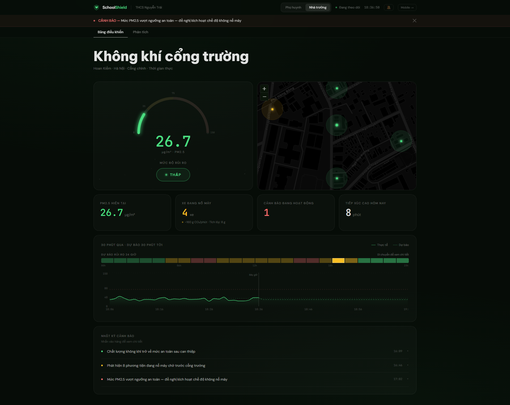
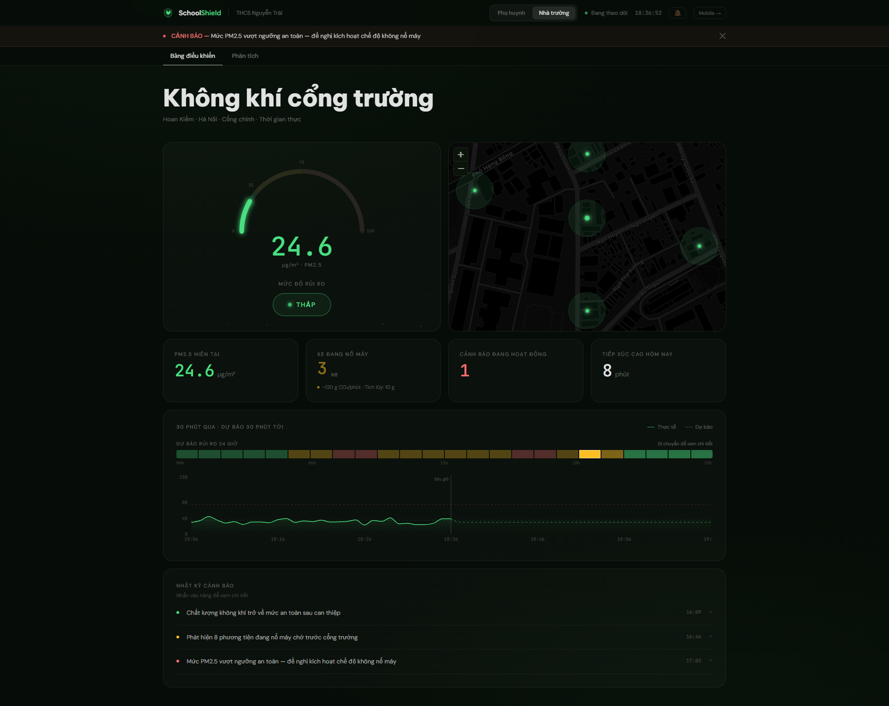
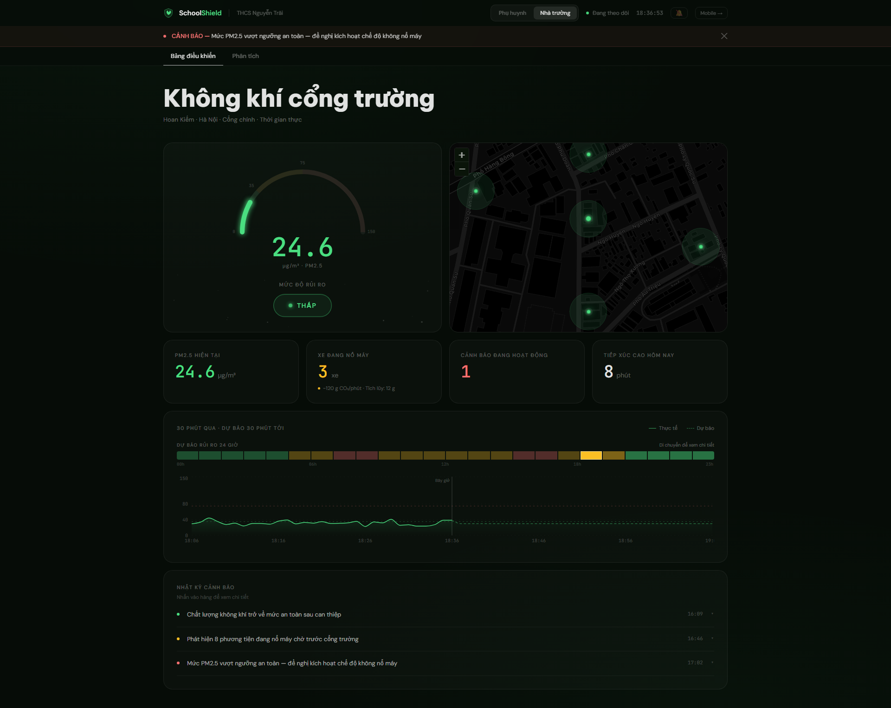
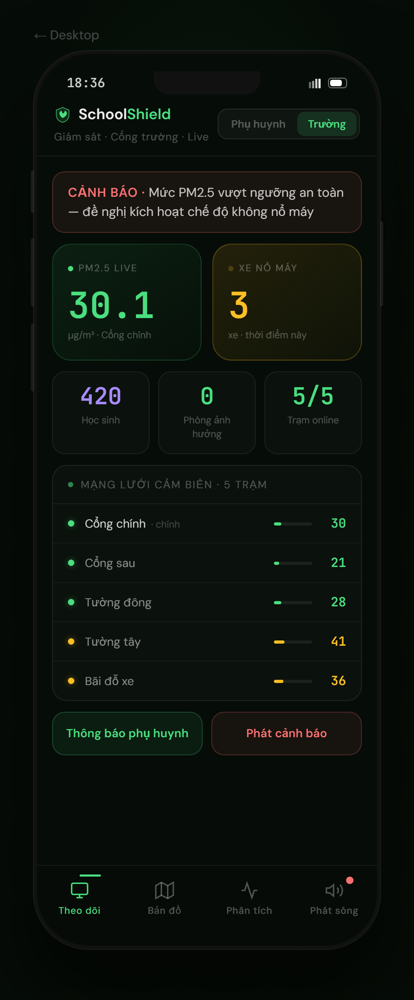

# ASIAN HACKATHON FOR GREEN FUTURE 2026
# PROJECT PROPOSAL — PRELIMINARY ROUND

---

**TEAM NAME:** GreenShield

**TEAM MEMBERS** (Maximum 4 members):

| No. | Full Name | Role |
|---|---|---|
| 1 | Dang Tuan Kiet | Team Leader / Backend & API |
| 2 | Le Minh Chau | Frontend & UI/UX |
| 3 | Le Huy Tam | Data Modeling & Simulation |
| 4 | Ngo Nhat Tan | DevOps & System Integration |

---

## 1. PROJECT OVERVIEW

**1.1 Project Title**
SchoolShield: Real-Time School Gate Air Quality Monitoring and Smart Alert System

**1.2 Key Challenge Area**
☑ Urban Air Quality and Climate Resilience

**1.3 Solution Category**
☑ Integrated Solution (Hardware + Software)

**1.4 Project Summary**

School entrances in Hanoi experience PM2.5 spikes of 120–135 µg/m³ during morning drop-off and afternoon pick-up — eight to nine times the WHO safe limit — driven by idling vehicles. Children are four times more susceptible to particulate matter than adults (HEI, 2010), yet no Vietnamese school currently has a real-time system to monitor or respond to this exposure. SchoolShield is a sensor-integrated, role-based air quality platform pairing a low-cost Nova SDS011 sensor (~USD 15) with a FastAPI/React 18 web application that gives school staff a live dashboard with an automatic action checklist, and gives parents a science-backed pick-up timing recommendation. Target beneficiaries are the 1.7 million K-12 students enrolled in Hanoi's approximately 2,800 schools, their parents, and school health administrators.

---

## 2. CONTEXT AND PROBLEM STATEMENT

School gate micro-environments concentrate vehicle idling into a confined space during predictable 30–60 minute windows. Gate-level PM2.5 in Hanoi-equivalent urban settings is 3–5× higher than the nearest fixed monitoring station (Ho et al., 2021), which measures background air rather than gate microclimate.

**Scale:** Hanoi's 2,800 schools serve 1.7 million students who arrive and depart 180–200 days per year — each event a recurring, predictable pollution exposure. Children's developing respiratory systems sustain proportionally greater damage from PM2.5 than adults; long-term exposure above 35 µg/m³ is associated with reduced adult lung capacity, higher asthma prevalence, and elevated cardiovascular risk.

**Urgency and gaps:** Vietnam's national network has fewer than 20 Hanoi monitoring stations — none at school gates. IQAir and AQICN report city-level AQI only, with no gate-level reading, no pick-up timing guidance, and no operational protocol for school staff. Without real-time data, staff cannot make evidence-based decisions on outdoor recess, gate management, or parent communication.

---

## 3. EXISTING SOLUTIONS AND GAP ANALYSIS

| Solution | Strengths | Critical Limitations |
|---|---|---|
| IQAir / AQICN / AirVisual | Free, city-wide coverage | City-level only; no role-specific interface; no timing guidance |
| Vietnam EPA station network | Authoritative data | Infrequent updates; no public API; no school-facing alert |
| Commercial IoT sensors (Awair, PurpleAir) | High spatial precision | USD 200–800/unit — prohibitive for public schools; no Vietnamese UI |
| Academic pilots (NUS, Air4Thai) | Research-grade accuracy | Not commercially available; no parent interface; not adapted for Vietnam |

**Gap:** No existing solution combines gate-level sensing, role-differentiated guidance (staff vs. parents), pick-up timing optimization, and deployment on a USD 15 sensor without specialist IT support.

---

## 4. PROPOSED SOLUTION AND CORE FEATURES

SchoolShield pairs a Nova SDS011 PM2.5 sensor with a dual-persona web platform. A physics-based simulator replaces the sensor for demo purposes, requiring only two backend functions to switch to live hardware.

**Feature 1 — Live Risk Dashboard (School Staff)**
Real-time AQI gauge, current PM2.5 reading, 30-minute trend chart, and an ambient color transition (green → red) giving staff immediate situational awareness. A "high-exposure minutes today" counter supports end-of-day health logging.

**Feature 2 — Automatic Action Checklist**
When PM2.5 exceeds 75 µg/m³, a structured checklist appears: close windows, notify parents via Zalo, move PE indoors, log the event. The checklist only activates when actionable, eliminating alert fatigue.

**Feature 3 — Smart Pick-Up Recommendation (Parents)**
Parents see one decision: *is it safe now, and if not, when?* A 3-hour Gaussian-model PM2.5 prediction, a recommended pick-up window, and a 24-hour daily pattern chart let parents avoid the afternoon peak. One-tap Zalo sharing delivers a formatted status message on the platform families already use.

**Feature 4 — Smart Alert Grouping**
Consecutive same-level alerts within 10 minutes are grouped into a single log entry, preventing overflow during sustained episodes. An optional 520 Hz chime signals the first transition to HIGH risk.

**Feature 5 — Sensor-Agnostic Architecture**
The frontend consumes a clean REST API (`/api/sensor/current`, `/api/sensor/history`, `/api/alerts`). Switching from simulator to a real sensor requires modifying two functions in the backend — no frontend changes needed.

---

## 5. INNOVATION AND COMPETITIVE ADVANTAGE

**Innovation:** SchoolShield is the first platform designed for the school-gate use case in Vietnam. The dual-persona architecture transforms a single PM2.5 reading into two different decisions: an operational checklist for staff and a pick-up timing recommendation for parents. Neither existing apps nor sensor platforms address this workflow.

**Competitive advantage:** Gate-level (not city-level), role-specific, Vietnamese-language, action-oriented, and compatible with a USD 15 sensor requiring no specialist deployment — a combination no competitor offers.

**Hackathon feasibility:** The prototype is fully operational with two commands (`uvicorn main:app --reload` + `npm run dev`). All five features are live. Hackathon extensions: (1) live SDS011 USB serial integration; (2) school registration flow; (3) Vietnamese VN_AQI thresholds (QCVN 06:2022/BTNMT).

**Post-hackathon roadmap:**
- Months 1–2: Pilot at 3 Hanoi schools; measure pick-up timing behavior change.
- Months 3–4: Add SQLite persistence, multi-gate admin console, live-sensor alert generation.
- Months 5–6: Publish open hardware spec; partnership outreach to Hanoi DOET.

---

## 6. TARGET GROUPS AND POTENTIAL IMPACT

**Primary users:** School staff (teachers, security guards, health staff); parents during pick-up windows.
**Secondary users:** School health administrators and city education authorities needing aggregate exposure data.

**Quantified impact:** A parent who delays pick-up by 30 minutes past the afternoon peak reduces their child's gate PM2.5 exposure from ~122 µg/m³ to ~32 µg/m³ — a 74% reduction based on the modeled daily pattern. If 20% of parents at an 800-student school shift to off-peak timing, approximately 160 children per day avoid peak exposure. Applying WHO PM2.5 dose-response coefficients, this averts ~8 DALYs annually per school — an economic health value of ~USD 12,000/school/year before accounting for avoided medical visits. The architecture is replicable to Ho Chi Minh City, Bangkok, Jakarta, and any city with school-gate vehicle idling.

---

## 7. DESCRIPTION OF TECHNOLOGIES APPLIED

**A. Proposed Technologies**
Python 3.10+, FastAPI, Uvicorn, Pydantic; React 18, Vite 5, Tailwind CSS 3, Recharts, Leaflet/React-Leaflet; Node.js 18+; Web Audio API; Clipboard API; Nova SDS011 PM2.5 sensor (USB serial / MQTT).

**B. System Architecture**

```
[Nova SDS011 Sensor / Gaussian Simulator]
         │
         ▼
  FastAPI Backend (port 8000)
  ├── GET /api/sensor/current   → { pm25, risk, idling_count, timestamp }
  ├── GET /api/sensor/history   → 30-min reading array
  ├── GET /api/alerts           → alert store
  └── POST /api/alerts/dismiss  → mutate store
         │  Vite proxy (/api → :8000)
         ▼
  React 18 Frontend (port 5173)
  ├── useAQI hook      — polls every 5 s
  ├── useAlerts hook   — polls every 10 s
  ├── Dashboard.jsx    — school staff view
  ├── ParentView.jsx   — parent view
  └── MobileView.jsx   — mobile layout
```

Risk computation and the Gaussian daily-pattern model run server-side. The formula is mirrored in the frontend for the pick-up prediction chart to avoid an extra API round-trip.

**C. Data and Infrastructure**
- **Data:** Gaussian simulator generating Hanoi school-gate PM2.5 patterns, validated against published school-gate measurements (Ho et al., 2021); designed for Nova SDS011 serial/MQTT.
- **Infrastructure:** Any computer running Python 3.10 and Node.js 18. No cloud services, no database, no API keys. Deployable on a school desktop or a USD 35 Raspberry Pi 4.

---

## 8. REFERENCES

1. WHO (2021). *WHO Global Air Quality Guidelines*. World Health Organization.
2. GINA (2023). *Global Strategy for Asthma Management and Prevention*. https://ginasthma.org/
3. Ho, D.T. et al. (2021). School-gate PM2.5 micro-environments in urban Vietnam. *Environmental Research Letters*, 16(8), 084003.
4. Hanoi DOET (2024). *Statistical Yearbook of Hanoi Education 2023–2024*. Hanoi: DOET Vietnam.
5. MONRE Vietnam (2022). *QCVN 06:2022/BTNMT — National Technical Regulation on Ambient Air Quality*.
6. IQAir (2025). *World Air Quality Report 2025*. IQAir AG.
7. HEI (2010). *Traffic-Related Air Pollution: A Critical Review*. Health Effects Institute, Special Report 17.
8. Nova Fitness (2024). SDS011 Laser PM2.5 Sensor Technical Specification.

---

## APPENDIX — Feature Demo Screenshots

**A.1 School dashboard (desktop) — live PM2.5, risk, map, and alerts**



**A.2 Analytics tab — trend and impact metrics**



**A.3 School dashboard (return state)**



**A.4 Parent view (desktop) — safe pickup recommendation and health tips**


**A.5 Mobile school view**


**A.6 Mobile parent view**


